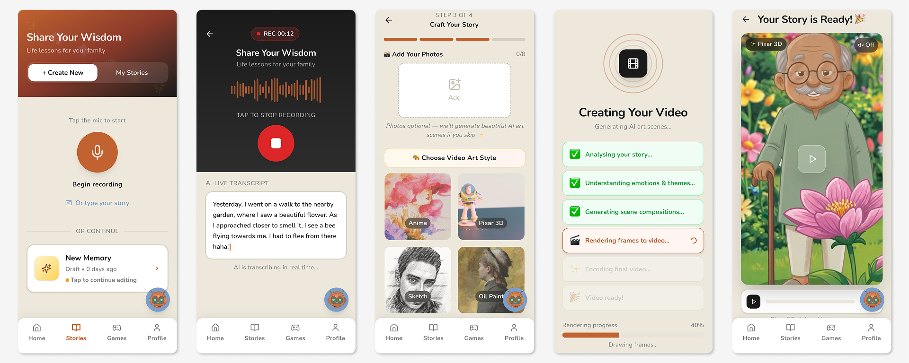
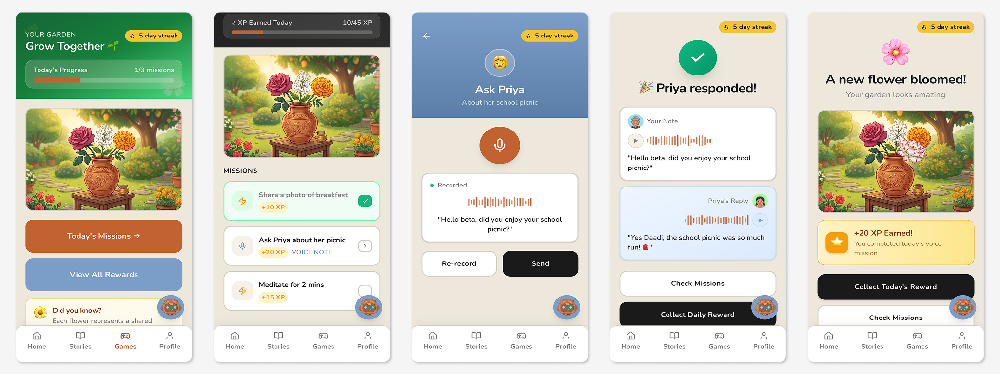
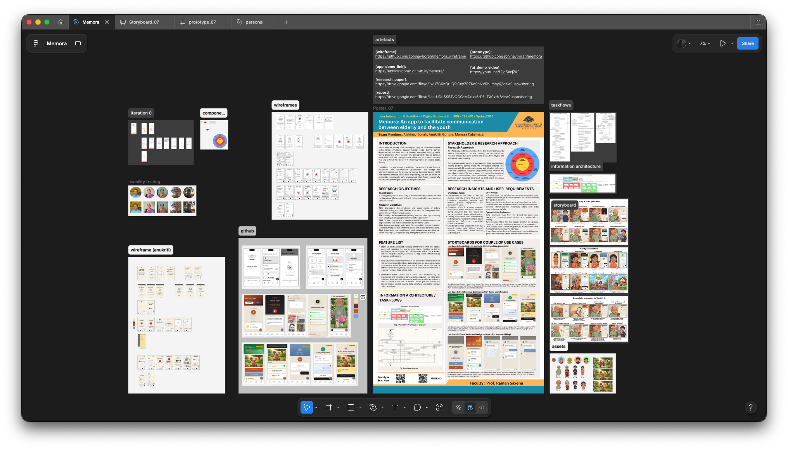
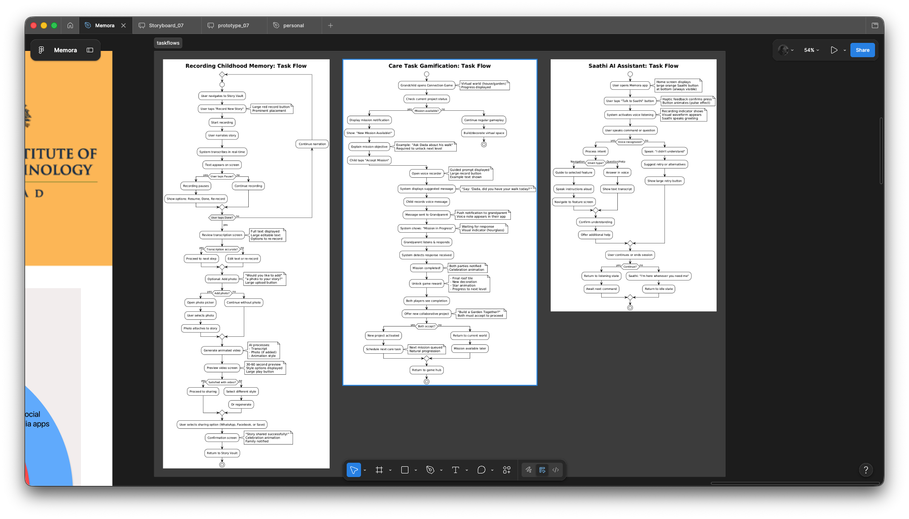

# Memora

Memora is a platform which aims to bridge the gap between grandparents and grandchildren.

> Social isolation among India’s elderly is rising as rapid urbanization shifts family structures toward nuclear units, leaving seniors disconnected and their cultural wisdom untapped. Existing social media platforms often exclude this demographic due to complex navigation, small touch targets, and a reliance on text-based interfaces that are difficult for those with declining vision or limited digital literacy.

> To address this, our project investigates how voice-first interfaces, AI assistance, and collaborative gamification can bridge the intergenerational gap. By employing Human-Centered Design (HCD), reminiscence therapy, and Kansei engineering, we aim to create an accessible, emotionally safe environment that fosters meaningful connection between grandparents and grandchildren.

## Youtube Demo

<iframe width="560" height="315" src="https://www.youtube.com/embed/f2jg5Xcj7KE?si=LVxlzR8gXCelaBMR" title="YouTube video player" frameborder="0" allow="accelerometer; autoplay; clipboard-write; encrypted-media; gyroscope; picture-in-picture; web-share" referrerpolicy="strict-origin-when-cross-origin" allowfullscreen></iframe>

## Research Papers and Report

Documents containing the entire journey and user research process:

- [Research Paper](https://drive.google.com/file/d/1wU7CKhQrLQ9iCeyZPZKq9nivVRhLmhyQ/view)
- [Report](https://drive.google.com/file/d/1ac_UDqSSBTvQGC-MDoxs5-P5JTX0xrfr/view)

## Project Description and Research Insights

Figma Project link documenting the entire journey:

https://www.figma.com/design/7pdHjeLYG7BDHF7JfNAd4R/Memora?node-id=0-1&t=8TfNMUSX5j5RZl4k-1

## Running the code

- Run `npm i` to install the dependencies.
- Run `npm run dev` to start the development server.

p.s. open the site on your phone for a better experience.
